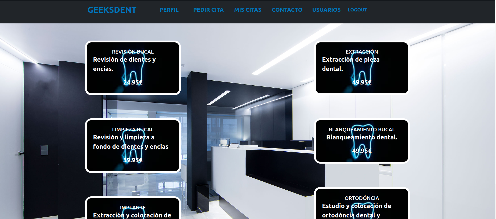
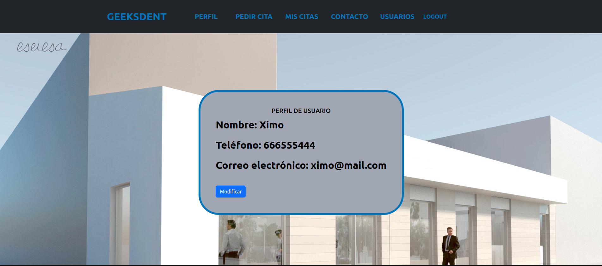
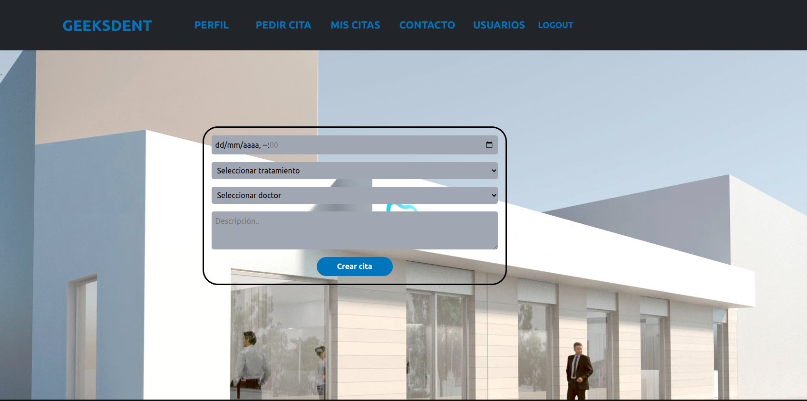
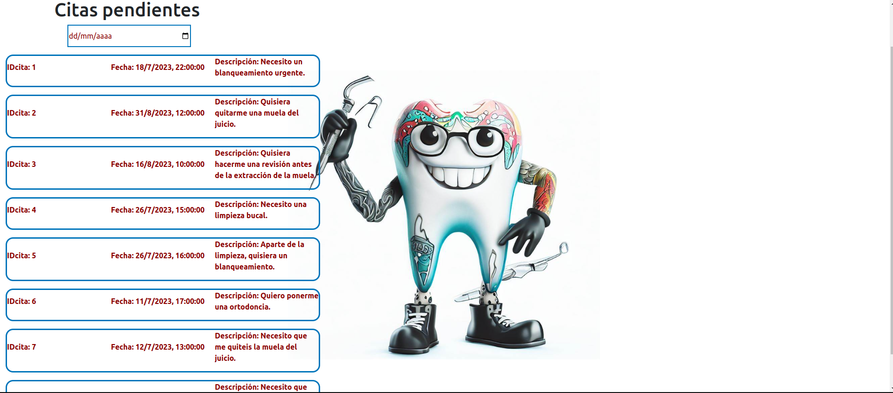
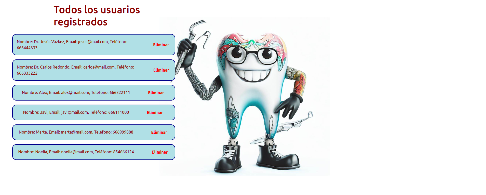

GeeksHubs Academy, Proyecto 5 :
# Frontend - Clinica Dental

## Tecnologías utilizadas
            

## Índice

- [Objetivo 🎯](#objetivo)
- [Vistas 🖥️](#vistas)
- [Desarrollo 🔧](#desarrollo)
- [Credenciales 🔐](#credenciales)
- [Repositorio 💾](#repositorio)
- [Instalación 💽] (#instalacion)
- [Agradecimientos 👏](#agradecimientos)

###  Objetivo 🎯
 
El objetivo de este proyecto es crear el frontend de una clinica dental funciona y conectar con un backend y una base de datos creados en el proyecto anterior (Proyecto 4).

Para alcanzar el objetivo se han incluido las vistas para cumplir con la funcionalidades básicas de una página web con las siguientes carácteristicas: login, registro,visualización de datos del usuario, modificación de datos del usuario, creación de citas, visualización de todas las citas y búsqueda de citas por fecha y modificación de citas

### Vistas 🖥️

####Home:

####Perfil usuario:

####Pedir cita:

####Citas del usuario:

####Todas las citas (como doctor):

####Todos los usuario (como admin):

### Desarrollo 🔧

La API ha sido desarrollada por Joaquin Ruiz Padrós como parte de la formación Full Stack Developer de GeeksHubs. 

Para la realización del proyecto, se han utilizado el siguiente stack tecnologico:

Se ha utilizado Vite-React-JS como base del proyecto y estructura básica para conseguir una SPA funcional.

Para la gestión de información entre los diferentes componentes de la APP se ha implementado REDUX. En este caso, el uso de REDUX se ha limitado a las credenciales del usuario ya que no se ha sido necesario implementarlo en el resto de vistas/componentes.

REDUX-PERSIST y REDUX-THUNK se han añadido como librerias adicionales para la conservación de las credenciales de la página a pesar del cierre de la pestaña o ventana del navegador.

En cuanto al diseño, se han utilizado componentes de Bootstrap y MDB-Bootstrap para conseguir un diseño atractivo y responsive.

Para levantar el backend se usa docker en los puertos 3006 y 3007. Una vez levantado el contenedor del docker se puede levantar el servidor del backend y ya se podria usar todas las funcionalidades del frontend con las consultas a la BD.

Por último, como herramientas utilitarias hemos usado JWC_DECODED para desencriptar los datos del token recibido por el backend e importar las credenciales correspondientes.

### Credenciales 🔐

Para poder comprobar el funcionamiento puedes logearte como Admin, Doctor y usuario:

#Admin:
####Email => ximo@mail.com
####Contraseña => admin123

###### Logeandote como Admin muestra el botón en el header de usuarios donde puedes ver todos los usuarios registrados.
-----------------------------------------------------

#Doctor:
####Email => jesus@mail.com ó carlos@mail.com
####Contraseña =>admin123

###### Logeandote como doctor muestra el botón Agenda donde puedes ver todas las citas pendientes y un buscador que filtra las citas por fecha.
-----------------------------------------------------

#Usuario:
####Email => alex@mail.com ó javi@mail.com ó marta@mail.com ó noelia@mail.com
####Contraseña => admin123

Como usuario tienes limitadas las vistas al home, pedir citas, ver tus citas y ver tu perfil.
-----------------------------------------------------

Puedes Registar tantos usuarios como quieras siendo el email unico, es decir, solo puedes registrar un email una vez.

### Instalación en local

####Seguiremos los siguientes pasos:

######Clonamos el repositorio $git clone 'url-repository'
######Instalamos las dependencias $ npm install
######Conectamos nuestro repositorio con la base de datos $ npx sequelize db:create
######Ejecutamos las migraciones $ npx sequelize db:migrate
######Ejecutamos los seeders $ npx sequelize db:seed:all
######Conectamos el servidor$ npm run dev

####En cuanto al frontend los pasos serán los siguientes:

######Clonar el repositorio
######$ npm install
######$ npm run dev

###  Repositorio en GitHub 💾

Frontend: https://github.com/xIMet3/frontendDentista
Backend: https://github.com/xIMet3/baseDatosDentista

### Agradecimientos 👏
Gracias a todos los compañeros que me han ayudado en especial a Jesus y Edu que me han apoyado desde el minuto uno.
